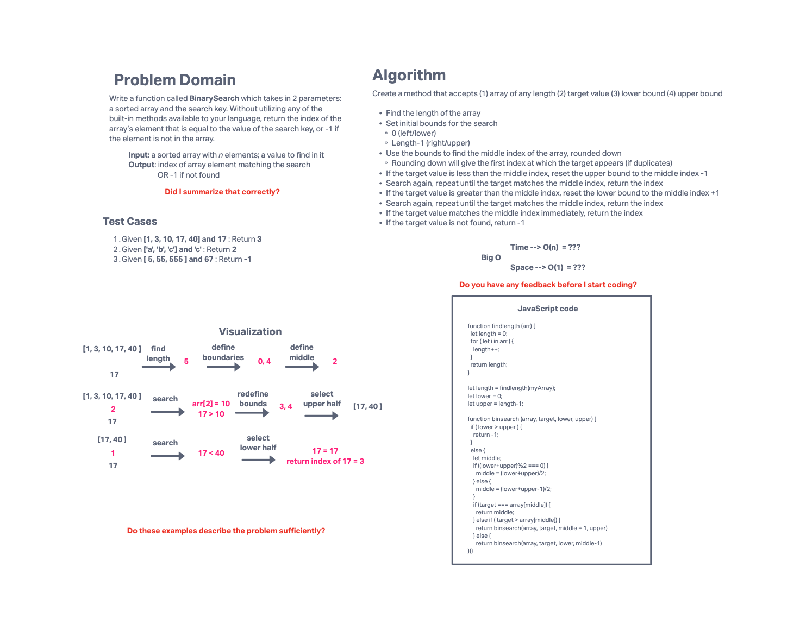

# 401 Challenge 03: Binary Search

Write a function called BinarySearch which takes in 2 parameters: a sorted array and the search key. Without utilizing any of the built-in methods available to your language, return the index of the array’s element that is equal to the value of the search key, or -1 if the element is not in the array.

## Whiteboard Process

## Approach & Efficiency

I read a couple of articles about binary search. The wikipedia article was not helpful, it was a bunch of math stuff that made my eyes hurt. The explanation at [https://www.geeksforgeeks.org/binary-search/#] helped a lot.

I used the recursive method instead of the iteration method for the binary search. I don't know what the difference is from a big-O point of view.

## Solution

Solution example is shown in the code block on the whiteboard.

Repl with working solution at [https://replit.com/@ndbrown1983/PolishedJauntyDesign#index.js]
