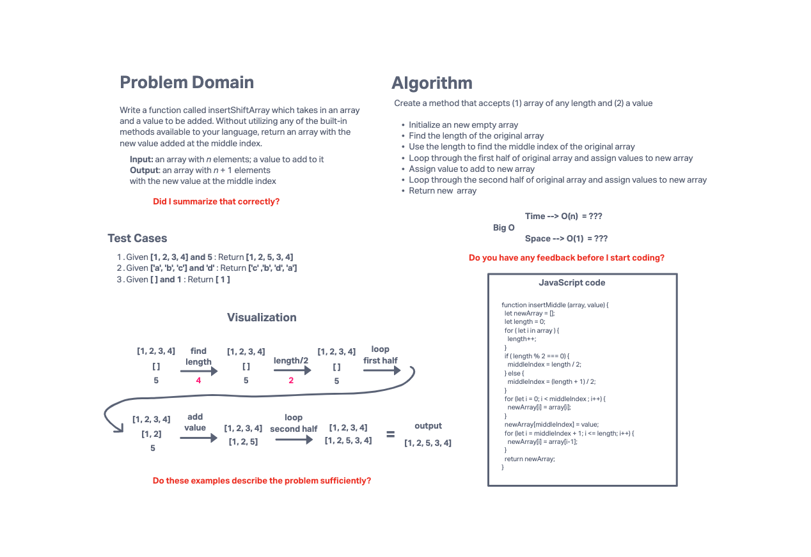

# 401 Challenge 02: Array Insert Shift

Write a function called insertShiftArray which takes in an array and a value to be added. Without utilizing any of the built-in methods available to your language, return an array with the new value added at the middle index.

## Whiteboard Process

<!--  -->

## Approach & Efficiency

An array of length `n` has a middle index at `n / 2`. For an array with an odd number of elements, say 5, the middle index would be at 2.5, but the index must be a non-negative integer and 2.5 rounded to 1 significant digit is 3.

I re-did this problem to not use any methods whatsoever and now I don't understand it in big O terms again

## Solution

Solution example is shown in the code block on the whiteboard

