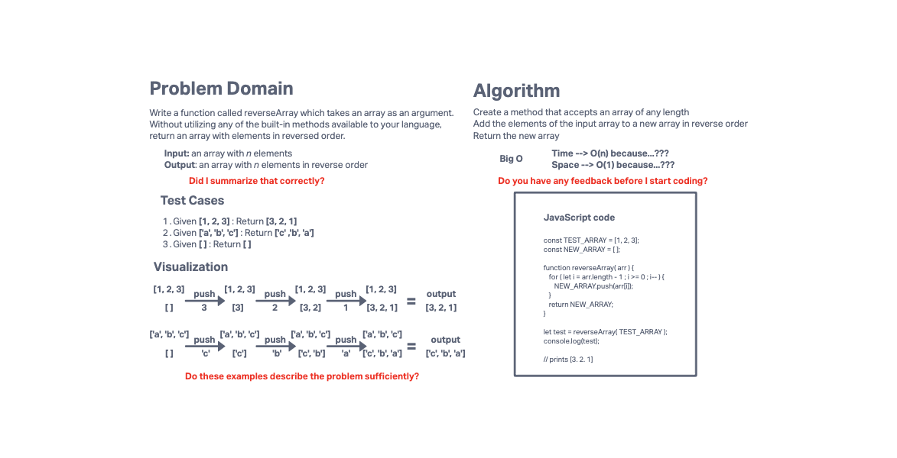

# 401 Challenge 01: Array Reverse

Write a function called reverseArray which takes an array as an argument. Without utilizing any of the built-in methods available to your language, return an array with elements in reversed order.

## Whiteboard Process

## Approach & Efficiency

I wrote this function using the simplest methods I was familiar with

## Solution

Solution example is shown in the code block on the whiteboard
