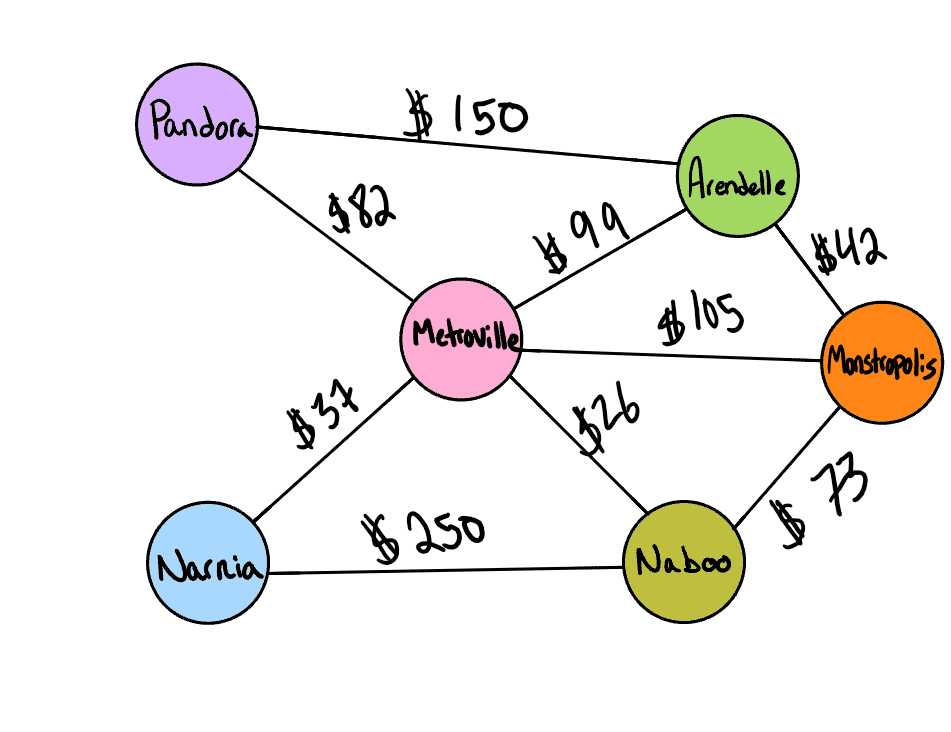

# Code Challenge 37: Graph Business Trip

Given a business trip itinerary, and an Alaska Airlines route map, is the trip possible with direct flights? If so, how much will the total trip cost be?

## Challenge Setup & Execution

Branch Name: graph-business-trip

Challenge Type: Code Challenge / Algorithm

## Feature Tasks

Write a function called business trip
Arguments: graph, array of city names
Return: the cost of the trip (if it’s possible) or null (if not)
Determine whether the trip is possible with direct flights, and how much it would cost.  

## Structure and Testing

Utilize the Single-responsibility principle: any methods you write should be clean, reusable, abstract component parts to the whole challenge. You will be given feedback and marked down if you attempt to define a large, complex algorithm in one function definition.

Write at least three test assertions for each method that you define.

Ensure your tests are passing before you submit your solution.

## Example

| Input | Output |
|---|---|
| [Metroville, Pandora, ] | $82 |
| [Arendelle, New Monstropolis, Naboo] | $115 |
| [Naboo, Pandora] | null |
| [Narnia, Arendelle, Naboo] | null |
