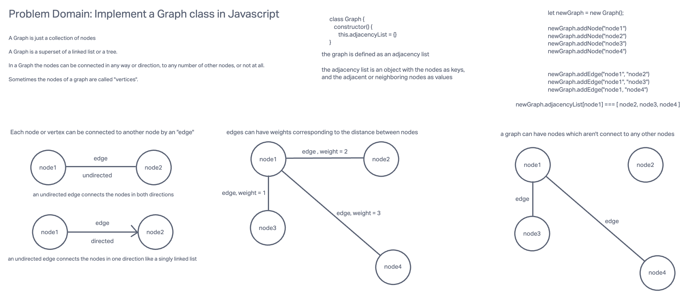

# Code Challenge 35

## Implementation: Graphs

### Challenge Setup & Execution

Branch Name: graph

Challenge Type: New Implementation

### Whiteboard

### Features

Implement your own Graph. The graph should be represented as an adjacency list, and should include the following methods:

- add node // DONE
  - Arguments: value
  - Returns: The added node
  - Add a node to the graph
- add edge // DONE
  - Arguments: 2 nodes to be connected by the edge, weight (optional)
  - Returns: nothing
  - Adds a new edge between two nodes in the graph
  - If specified, assign a weight to the edge
  - Both nodes should already be in the Graph
- get nodes // DONE
  - Arguments: none
  - Returns all of the nodes in the graph as a collection (set, list, or similar)
  - Empty collection returned if there are no nodes
- get neighbors // DONE
  - Arguments: node
  - Returns a collection of edges connected to the given node
  - Include the weight of the connection in the returned collection
  - Empty collection returned if there are no nodes
- size // DONE
  - Arguments: none
  - Returns the total number of nodes in the graph
  - 0 if there are none

### Write tests to prove the following functionality:

// DONE
Node can be successfully added to the graph

// DONE
An edge can be successfully added to the graph

// DONE
A collection of all nodes can be properly retrieved from the graph

// DONE
All appropriate neighbors can be retrieved from the graph

// DONE
Neighbors are returned with the weight between nodes included

// DONE
The proper size is returned, representing the number of nodes in the graph

// DONE
A graph with only one node and edge can be properly returned

Ensure your tests are passing before you submit your solution.
