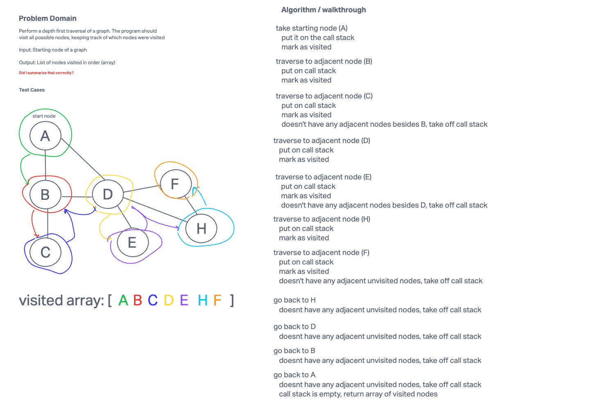

# Code Challenge 38

Conduct a depth first pre-order traversal on a graph

## Whiteboard

## Challenge Setup & Execution

Branch Name: graph-depth-first

Challenge Type: Extending an Implementation

## Feature Tasks

Write the following method for the Graph class:

- Name: Depth first
  - Arguments: Node (Starting point of search)
  - Return: A collection of nodes in their pre-order depth-first traversal order
  - Program output: Display the collection

Example

Graph

Output: A, B, C, G, D, E, H, F

## Structure and Testing

Utilize the Single-responsibility principle: any methods you write should be clean, reusable, abstract component parts to the whole challenge. You will be given feedback and marked down if you attempt to define a large, complex algorithm in one function definition.

Write at least three test assertions for each method that you define.

Ensure your tests are passing before you submit your solution.
