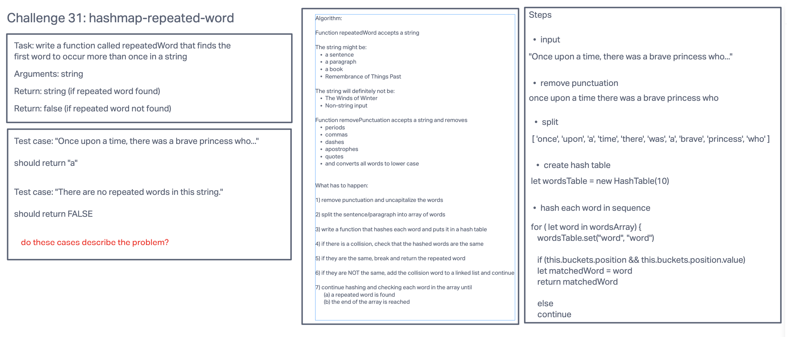

# Code Challenge 31: Hashmap Repeated Word

Find the first repeated word in a book.

## Whiteboard

## Challenge Setup & Execution

Branch Name: hashmap-repeated-word

## Challenge Type: Code Challenge / Algorithm

## Feature Tasks

- Write a function called repeated word that finds the first word to occur more than once in a string
  - Arguments: string
  - Return: string

## Structure and Testing

Utilize the Single-responsibility principle: any methods you write should be clean, reusable, abstract component parts to the whole challenge. You will be given feedback and marked down if you attempt to define a large, complex algorithm in one function definition.

Write at least three test assertions for each method that you define.

Ensure your tests are passing before you submit your solution.

Example

Input	Output

"Once upon a time, there was a brave princess who..."	"a"

"It was the best of times, it was the worst of times, it was the age of wisdom, it was the age of foolishness, it was the epoch of belief, it was the epoch of incredulity, it was the season of Light, it was the season of Darkness, it was the spring of hope, it was the winter of despair, we had everything before us, we had nothing before us, we were all going direct to Heaven, we were all going direct the other way – in short, the period was so far like the present period, that some of its noisiest authorities insisted on its being received, for good or for evil, in the superlative degree of comparison only..."	"it"

"It was a queer, sultry summer, the summer they electrocuted the Rosenbergs, and I didn’t know what I was doing in New York..."	"summer"

## Stretch Goals

Modify your function to return a count of each of the words in the provided string

Modify your function to return a list of the words most frequently used in the provided string