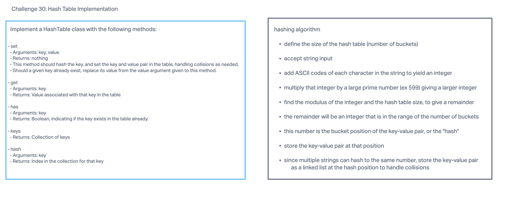

# Challenge 30: Hash Table Implementation

## Whiteboard

## Challenge Setup & Execution

Branch Name: hashtable

Challenge Type: New Implementation

## Features

Implement a Hashtable Class with the following methods:

- set (DONE)
  - Arguments: key, value
  - Returns: nothing
  - This method should hash the key, and set the key and value pair in the table, handling collisions as needed.
  - Should a given key already exist, replace its value from the value argument given to this method.

- get (DONE)
  - Arguments: key
  - Returns: Value associated with that key in the table

- has (DONE)
  - Arguments: key
  - Returns: Boolean, indicating if the key exists in the table already.

- keys (DONE)
  - Returns: Collection of keys

- hash (DONE)
  - Arguments: key
  - Returns: Index in the collection for that key

## Structure and Testing

Utilize the Single-responsibility principle: any methods you write should be clean, reusable, abstract component parts to the whole challenge. You will be given feedback and marked down if you attempt to define a large, complex algorithm in one function definition.

Be sure to follow your language/frameworks standard naming conventions (e.g. C# uses PascalCasing for all method and class names).

Any exceptions or errors that come from your code should be contextual, descriptive, capture-able errors. For example, rather than a default error thrown by your language, your code should raise/throw a custom error that describes what went wrong in calling the methods you wrote for this lab.

## Write tests to prove the following functionality:

// DONE // Setting a key/value to your hashtable results in the value being in the data structure

// DONE // Retrieving based on a key returns the value stored

// DONE // Successfully returns null for a key that does not exist in the hashtable

// DONE // Successfully returns a list of all unique keys that exist in the hashtable

// DONE // Successfully handle a collision within the hashtable

// DONE // Successfully retrieve a value from a bucket within the hashtable that has a collision

// DONE // Successfully hash a key to an in-range value

Ensure your tests are passing before you submit your solution.
