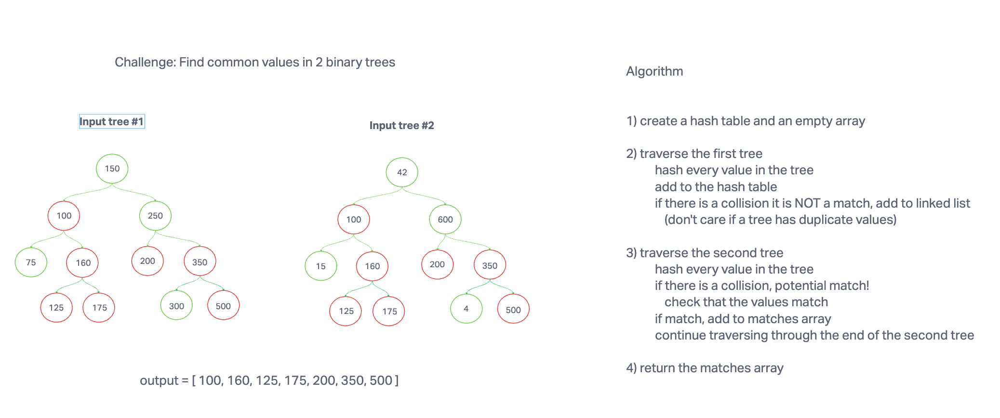

# Code Challenge 32: Tree Intersection

Find common values in 2 binary trees.

## Whiteboard

## Feature Tasks

Write a function called tree_intersection that takes two binary trees as parameters.
Using your Hashmap implementation as a part of your algorithm, return a set of values found in both trees.

## Structure and Testing

Utilize the Single-responsibility principle: any methods you write should be clean, reusable, abstract component parts to the whole challenge. You will be given feedback and marked down if you attempt to define a large, complex algorithm in one function definition.

Write at least three test assertions for each method that you define.

Ensure your tests are passing before you submit your solution.

## Example

### Input:

BinaryTree1

BinaryTree2

### Output:

100,160,125,175,200,350,500

## Stretch Goal

Describe how you might solve this differently if the parameters were Binary Search Trees.

What are the potential efficiency differences?