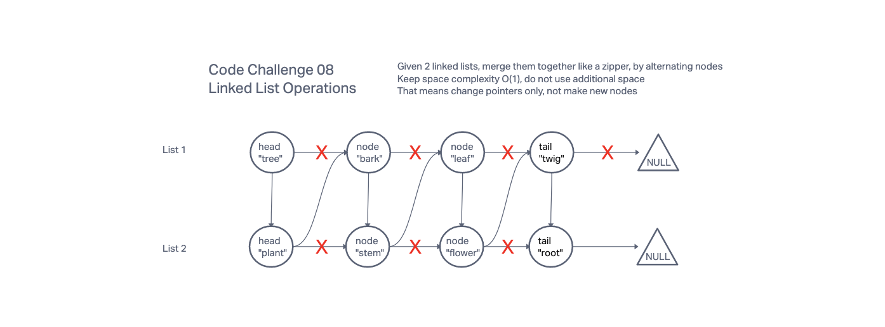

# 401 Challenge 08: Linked List Zipper

Write the following method for the Linked List class:

Write a function called zip lists

Arguments: 2 linked lists

Return: New Linked List, zipped as noted below

Zip the two linked lists together into one so that the nodes alternate between the two lists and return a reference to the the zipped list.

Try and keep additional space down to O(1)

You have access to the Node class and all the properties on the Linked List class as well as the methods created in previous challenges.

## Whiteboard Process

// needs new whiteboard

## Approach & Efficiency

Work based on methods previously defined in Challenge 05.

## Structure & Testing

Write tests to prove the following functionality:

Example

zipLists(list1, list2)

Arg list1	Arg list2	Output
{1} -> {3} -> {2} -> null	{5} -> {9} -> {4} -> null	{1} -> {5} -> {3} -> {9} -> {2} -> {4} -> null
{1} -> {3} -> null	{5} -> {9} -> {4} -> null	{1} -> {5} -> {3} -> {9} -> {4} -> null
{1} -> {3} -> {2} -> null	{5} -> {9} -> null	{1} -> {5} -> {3} -> {9} -> {2} -> null

## Solution

Solution is in the code.
