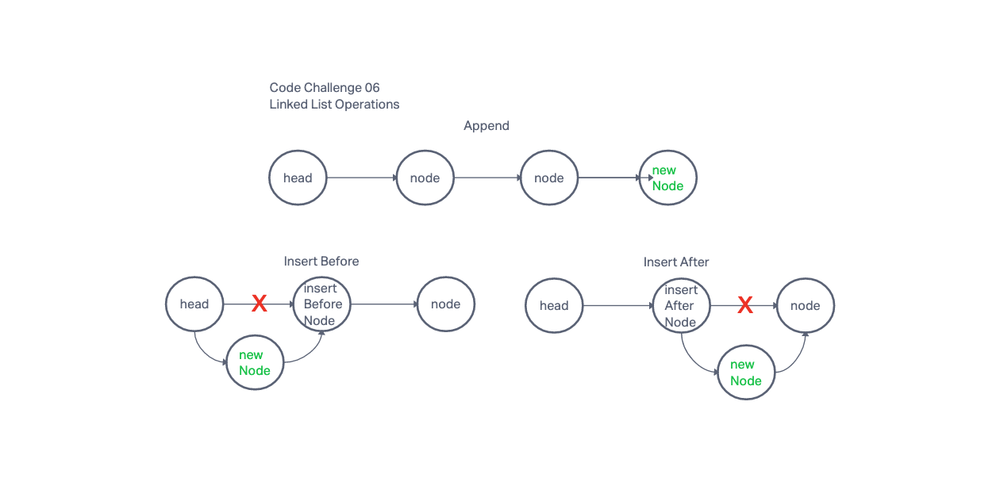

# 401 Challenge 06: Linked List Insertions

Write the following methods for the Linked List class:

- append // DONE
  - arguments: new value
  - adds a new node with the given value to the end of the list
- insert before // DONE
  - arguments: value, new value
  - adds a new node with the given new value immediately before the first node that has the value specified
- insert after // DONE
  - arguments: value, new value
  - adds a new node with the given new value immediately after the first node that has the value specified

## Whiteboard Process

## Approach & Efficiency

Work based on methods previously defined in Challenge 05.

## Structure & Testing

Write tests to prove the following functionality:

- Can successfully add a node to the end of the linked list // DONE
  - function `append()` adds a new node to the end of the list

- Can successfully add multiple nodes to the end of a linked list // DONE
  - calling function `append()` multiple times will add multiple nodes to the end of the list

- Can successfully insert a node before a node located in the middle of a linked list // DONE

- Can successfully insert a node before the first node of a linked list // DONE

- Can successfully insert after a node in the middle of the linked list // DONE

- Can successfully insert a node after the last node of the linked list
  - I don't understand what this function is supposed to do. The `append()` function already performs this action

Unit tests must be passing before you submit your final solution code.

## Solution

Solution is in the code.
