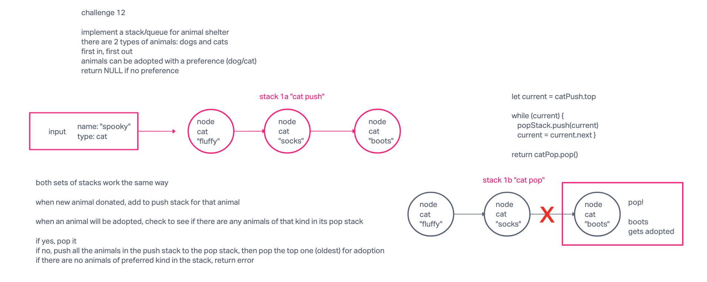

# Specifications

## Branch Name: stack-queue-animal-shelter

### Challenge Type: New Implementation

#### Features

Challenge Setup & Execution

Branch Name: stack-queue-pseudo

Challenge Type: Code Challenge / Algorithm

- Feature Tasks
  - Create a class called AnimalShelter which holds only dogs and cats.
  - The shelter operates using a first-in, first-out approach.
  - Implement the following methods:
    - enqueue
      - Arguments: animal
        - animal can be either a dog or a cat object.
      - It must have a species property that is either "cat" or "dog"
      - It must have a name property that is a string.
    - dequeue
      - Arguments: pref
        - pref can be either "dog" or "cat"
      - Return: either a dog or a cat, based on preference.
      - If pref is not "dog" or "cat" then return null.

#### Structure and Testing

Utilize the Single-responsibility principle: any methods you write should be clean, reusable, abstract component parts to the whole challenge. You will be given feedback and marked down if you attempt to define a large, complex algorithm in one function definition.

Be sure to follow your language/frameworks standard naming conventions (e.g. C# uses PascalCasing for all method and class names).

Any exceptions or errors that come from your code should be contextual, descriptive, capture-able errors. For example, rather than a default error thrown by your language, your code should raise/throw a custom error that describes what went wrong in calling the methods you wrote for this lab.

#### Write tests to prove the following functionality

Can accept donated animal and push to appropriate stack
Can accept preference input for adoption and return animal of correct species
Can return NULL if no preference
Can return error if no animals of preferred type available

stretch goal: can return oldest animal if no preference specified
