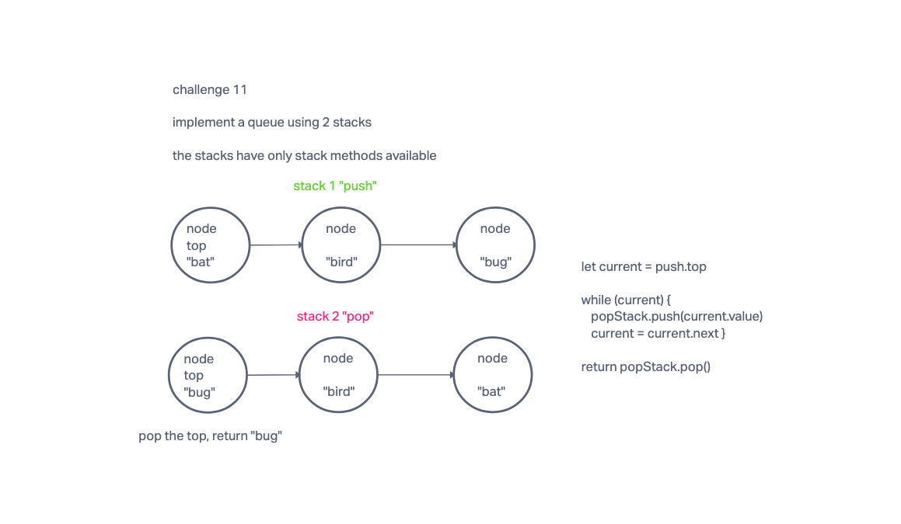

# Specifications

## Branch Name: stack-queue-pseudo

### Challenge Type: New Implementation

#### Features

Challenge Setup & Execution

Branch Name: stack-queue-pseudo

Challenge Type: Code Challenge / Algorithm

- Feature Tasks
  - Create a new class called pseudo queue.
  - Do not use an existing Queue.
  - Instead, this PseudoQueue class will implement our standard queue interface (the two methods listed below),
  - Internally, utilize 2 Stack instances to create and manage the queue
  - Methods:
    - enqueue
      - Arguments: value
      - Inserts a value into the PseudoQueue, using a first-in, first-out approach.
    - dequeue
      - Arguments: none
      - Extracts a value from the PseudoQueue, using a first-in, first-out approach.
      - NOTE: The Stack instances have only push, pop, and peek methods. You should use your own Stack implementation
    - Instantiate these Stack objects in your PseudoQueue constructor.

Example
enqueue(value)
Input	Args	Internal State
[10]->[15]->[20]	5	[5]->[10]->[15]->[20]
 	5	[5]

dequeue()
Input	Output	Internal State
[5]->[10]->[15]->[20]	20	[5]->[10]->[15]
[5]->[10]->[15]	15	[5]->[10]

#### Structure and Testing

Utilize the Single-responsibility principle: any methods you write should be clean, reusable, abstract component parts to the whole challenge. You will be given feedback and marked down if you attempt to define a large, complex algorithm in one function definition.

Be sure to follow your language/frameworks standard naming conventions (e.g. C# uses PascalCasing for all method and class names).

Any exceptions or errors that come from your code should be contextual, descriptive, capture-able errors. For example, rather than a default error thrown by your language, your code should raise/throw a custom error that describes what went wrong in calling the methods you wrote for this lab.

#### Write tests to prove the following functionality

DONE

Can push to pseudo queue

DONE

Can pop from pseudo queue