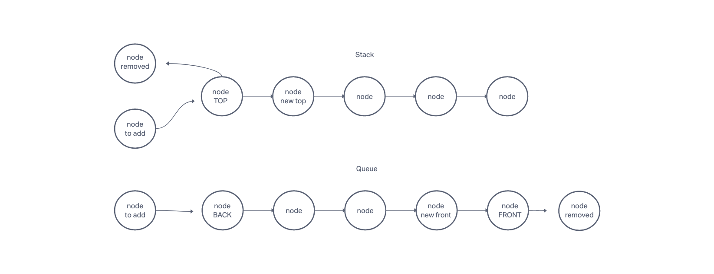

# Specifications

## Branch Name: stack-and-queue

### Challenge Type: New Implementation

#### Features

Using a Linked List as the underlying data storage mechanism, implement both a Stack and a Queue

- Node
  - Create a Node class that has properties for the value stored in the Node, and a pointer to the next node.

- Stack
  - Create a Stack class that has a top property. It creates an empty Stack when instantiated.
  - This object should be aware of a default empty value assigned to top when the stack is created.
  - The class should contain the following methods:
    DONE
    - push
      - Arguments: value
      - adds a new node with that value to the top of the stack with an O(1) Time performance.
    DONE
    - pop
      - Arguments: none
      - Returns: the value from node from the top of the stack
      - Removes the node from the top of the stack
      - Should raise exception when called on empty stack
    - peek
      - Arguments: none
      - Returns: Value of the node located at the top of the stack
      - Should raise exception when called on empty stack
    - is empty
      - Arguments: none
      - Returns: Boolean indicating whether or not the stack is empty.

- Queue
  - Create a Queue class that has a front property. It creates an empty Queue when instantiated.
  - This object should be aware of a default empty value assigned to front when the queue is created.
  - The class should contain the following methods:
    - enqueue
      - Arguments: value
      - adds a new node with that value to the back of the queue with an O(1) Time performance.
    - dequeue
      - Arguments: none
      - Returns: the value from node from the front of the queue
      - Removes the node from the front of the queue
      - Should raise exception when called on empty queue
    - peek
      - Arguments: none
      - Returns: Value of the node located at the front of the queue
      - Should raise exception when called on empty stack
    - is empty
      - Arguments: none
      - Returns: Boolean indicating whether or not the queue is empty

You have access to the Node class and all the properties on the Linked List class.

#### Structure and Testing

Utilize the Single-responsibility principle: any methods you write should be clean, reusable, abstract component parts to the whole challenge. You will be given feedback and marked down if you attempt to define a large, complex algorithm in one function definition.

Be sure to follow your language/frameworks standard naming conventions (e.g. C# uses PascalCasing for all method and class names).

Any exceptions or errors that come from your code should be contextual, descriptive, capture-able errors. For example, rather than a default error thrown by your language, your code should raise/throw a custom error that describes what went wrong in calling the methods you wrote for this lab.

#### Write tests to prove the following functionality:

- Can successfully push onto a stack
- Can successfully push multiple values onto a stack
- Can successfully pop off the stack
- Can successfully empty a stack after multiple pops
- Can successfully peek the next item on the stack
- Can successfully instantiate an empty stack
- Calling pop or peek on empty stack raises exception
- Can successfully enqueue into a queue
- Can successfully enqueue multiple values into a queue
- Can successfully dequeue out of a queue the expected value
- Can successfully peek into a queue, seeing the expected value
- Can successfully empty a queue after multiple dequeues
- Can successfully instantiate an empty queue
- Calling dequeue or peek on empty queue raises exception
- Ensure your tests are passing before you submit your solution
