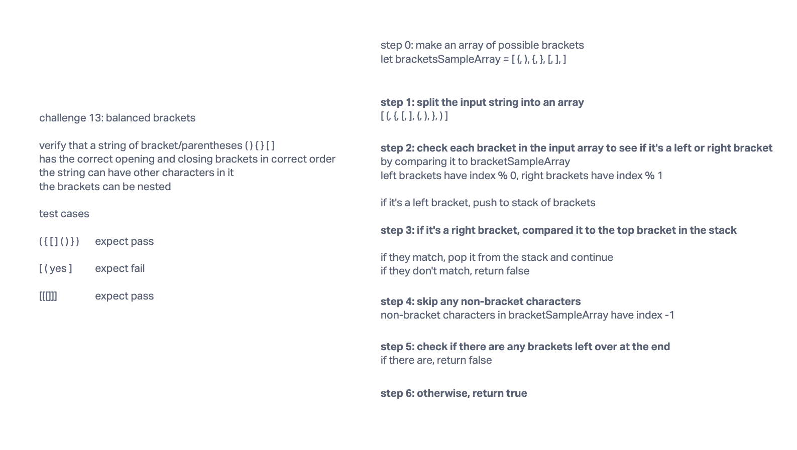

# Specifications

## Branch Name: stack-queue-brackets

### Challenge Type: New Implementation: Multi-Bracket Validation

#### Features

Challenge Type: Code Challenge / Algorithm

### Challenge Setup & Execution

- Feature Tasks
  - Write a function called validate brackets
  - Arguments: string
  - Return: boolean representing whether or not the brackets in the string are balanced

There are 3 types of brackets:

- Round Brackets : ()
- Square Brackets : []
- Curly Brackets : {}

Example
Input	Output
{}	TRUE
{}(){}	TRUE
()[[Extra Characters]]	TRUE
(){}[[]]	TRUE
{}{Code}[Fellows](())	TRUE
[({}]	FALSE
(](	FALSE
{(})	FALSE
Consider these small examples and why they fail.

Input	Output	Why
{	FALSE	error unmatched opening { remaining.
)	FALSE	error closing ) arrived without corresponding opening.
[}	FALSE	error closing }. Doesn’t match opening (.

#### Structure and Testing

Utilize the Single-responsibility principle: any methods you write should be clean, reusable, abstract component parts to the whole challenge. You will be given feedback and marked down if you attempt to define a large, complex algorithm in one function definition.

Be sure to follow your language/frameworks standard naming conventions (e.g. C# uses PascalCasing for all method and class names).

Any exceptions or errors that come from your code should be contextual, descriptive, capture-able errors. For example, rather than a default error thrown by your language, your code should raise/throw a custom error that describes what went wrong in calling the methods you wrote for this lab.

#### Write tests to prove the following functionality

Can return true if brackets match
Can return false if brackets don't match
Can return false if there are lone unmatched brackets