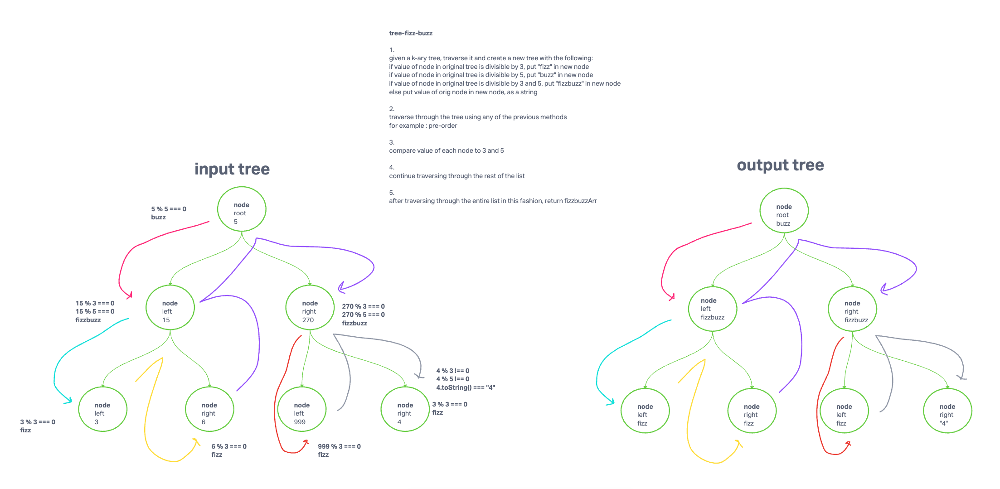
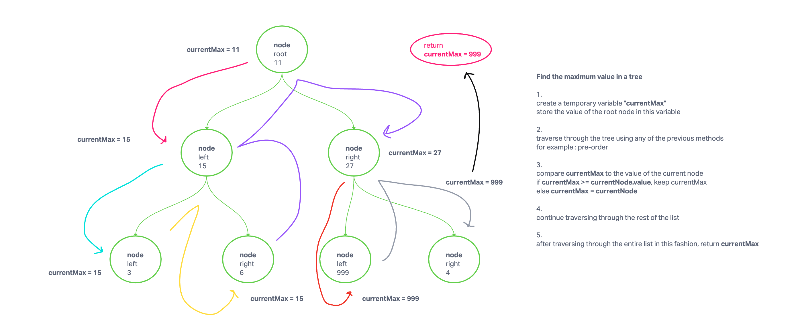
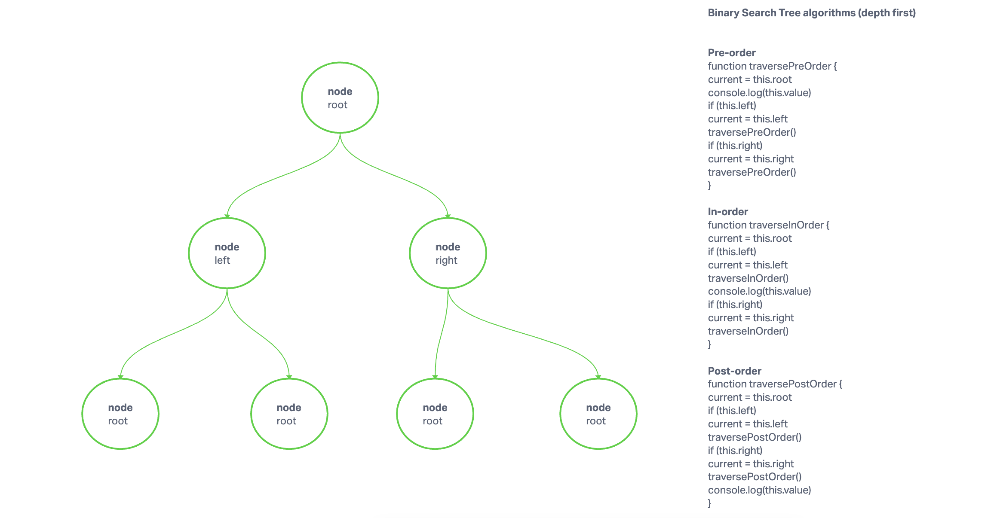

# Specifications

## Branch Name: tree-fizz-fizz

PENDING IMPLEMENTATION

Challenge Setup & Execution
Branch Name: tree-fizz-buzz

Challenge Type: Code Challenge / Algorithm

Feature Tasks
Write a function called fizz buzz tree
Arguments: k-ary tree
Return: new k-ary tree
Determine whether or not the value of each node is divisible by 3, 5 or both. Create a new tree with the same structure as the original, but the values modified as follows:

If the value is divisible by 3, replace the value with “Fizz”
If the value is divisible by 5, replace the value with “Buzz”
If the value is divisible by 3 and 5, replace the value with “FizzBuzz”
If the value is not divisible by 3 or 5, simply turn the number into a String.

## Branch Name: tree-max

Code Challenge
Find the Maximum Value in a Binary Tree

Specifications
Read all of these instructions carefully.
Name things exactly as described.
Do all your work in a your data-structures-and-algorithms public repository.
Create a new branch in your repo named as noted below.
Follow the language-specific instructions for the challenge type listed below.
Update the “Table of Contents” - in the README at the root of the repository - with a link to this challenge’s README file.
Challenge Setup & Execution
Branch Name: tree-max

Challenge Type: Extending an Implementation

Feature Tasks
Write the following method for the Binary Tree class

find maximum value
Arguments: none
Returns: number
Find the maximum value stored in the tree. You can assume that the values stored in the Binary Tree will be numeric.

### Challenge Type: New Implementation: Binary Search Tree

### Challenge Setup & Execution

#### Features

- Node
  - Create a Node class that has properties for the value stored in the node, the left child node, and the right child node.

- Binary Tree
  - Create a Binary Tree class

- Define a method for each of the depth first traversals:
  - pre order
  - in order
  - post order
  - Each depth first traversal method should return an array of values, ordered appropriately.

- Binary Search Tree
  - Create a Binary Search Tree class
  - This class should be a sub-class (or your languages equivalent) of the Binary Tree Class, with the following additional methods:
    - Add
      - Arguments: value
      - Return: nothing
      - Adds a new node with that value in the correct location in the binary search tree.
    - Contains
      - Argument: value
      - Returns: boolean indicating whether or not the value is in the tree at least once.

#### Structure and Testing

Utilize the Single-responsibility principle: any methods you write should be clean, reusable, abstract component parts to the whole challenge. You will be given feedback and marked down if you attempt to define a large, complex algorithm in one function definition.

Be sure to follow your language/frameworks standard naming conventions (e.g. C# uses PascalCasing for all method and class names).

Any exceptions or errors that come from your code should be contextual, descriptive, capture-able errors. For example, rather than a default error thrown by your language, your code should raise/throw a custom error that describes what went wrong in calling the methods you wrote for this lab.

#### Write tests to prove the following functionality

Can return true if brackets match
Can return false if brackets don't match
Can return false if there are lone unmatched brackets